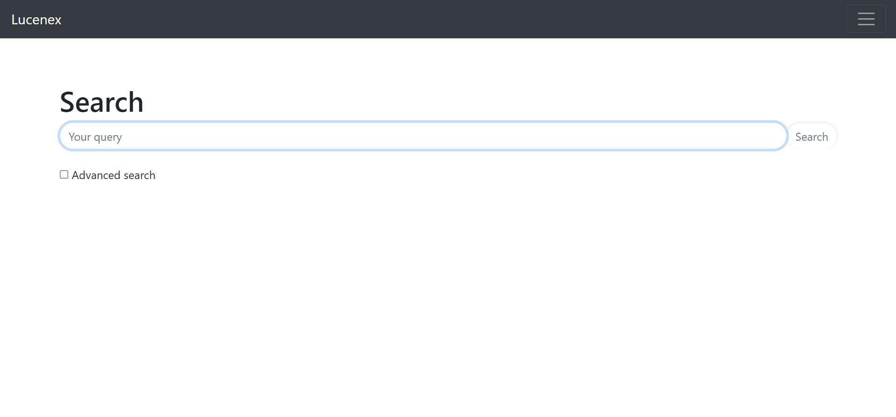

# Homework 2 - Lucenex
Lucenex is for indexing and searching purposes only.



## Experiments
Experiments can be executed as tests in ```core/src/main/test/java```

## Datasets

Poems: https://www.kaggle.com/datasets/michaelarman/poemsdataset
Recipes: https://www.kaggle.com/datasets/shuyangli94/food-com-recipes-and-user-interactions

## Docker
You can execute the Spring Boot application in Docker
```sh
docker build -p 8080:8080 -t lucenex .
docker run -d lucenex
```

If you want, you can pull the project from Dockerhub, but you will be unable to use your own datasets

```sh
docker pull phi180/lucenex
```
